# 10FF Live WPM Script

How to Setup Video : https://www.youtube.com/watch?v=u9ihTqpMX8E

1. [Preview](#preview)
2. [What are those numbers?](#what-are-those-numbers)
3. [How to Install](#how-to-install)
4. [Supported languages](#supported-languages)
5. [Custom Stylish theme](#custom-stylish-theme)
6. [Customization](#customization)
7. [Auto-Update](#auto-update)
8. [Bug reports, suggestions, contact](#bug-reports-suggestions-contact)

## Preview

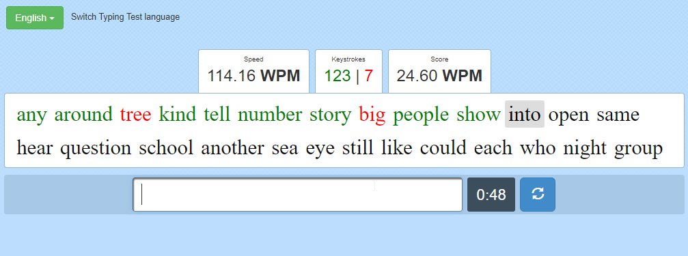

## What are those numbers?

All of these values are updated whenever you go to the next word (pressing space).

- The "_Speed_" value is your current speed (in WPM = Words Per Minute)
- The "_Keystrokes_" values are the number of keystrokes you hit:
  - In green, the correct keystrokes and in red, the wrong keystrokes
  - On 10FF, when you typed a word wrong, all the keystrokes are considered wrong, even if you did just one mistake
- The "_Words_" value is the number of words you typed:
  - In green, the correct words and in red, the wrong words
  - On 10FF, when you typed a word wrong, it is considered wrong even if you did just one mistake
- The "_Score_" value is your current score (in WPM). If you stop the test, the score will be your final result. Your final result can not be less than the score.

## How to Install

### 1.
Download the **tampermonkey** extension or an equivalent:
- Chrome: https://chrome.google.com/webstore/detail/tampermonkey/dhdgffkkebhmkfjojejmpbldmpobfkfo?hl=en
- Firefox: https://addons.mozilla.org/en-US/firefox/addon/tampermonkey/

### 2.

  
Click on the extension, then <b>Create New Script</b>

  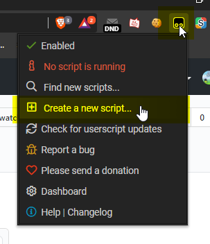

### 3.
Copy & paste the content of the [script.js](./script.js) file, and save it

### 4.

  
Now you can go on <a href="https://10fastfingers.com/typing-test/">https://10fastfingers.com/typing-test</a> and toggle the script by clicking on the icon

  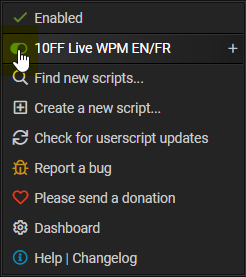

## Supported languages

A lot of languages are now supported by the script. Instead of writing the **supported languages**, here are the **unsupported languages**:

**UNSUPPORTED LANGUAGES:**
-  Arabic
-  Armenian
-  Bengali
-  Chinese
-  Georgian
-  Hebrew
-  Hindi
-  Japanese
-  Korean
-  Kurdish
-  Macedonian
-  Pashto

If you wish me to add keystrokes rules for these languages, feel free to create an issue or contact me on Discord.

## Custom Stylish theme

It supports [Stylish](https://chrome.google.com/webstore/detail/stylish-custom-themes-for/fjnbnpbmkenffdnngjfgmeleoegfcffe?hl=en) themes. The graphic appareance of the values displayed by the script will adapt depending on the style you use.

Here are some examples:

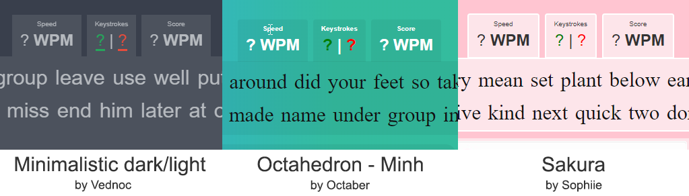

## Customization

  
To Edit the script, click on the <b>+</b> icon to the right of the script, then <b>Edit</b>

  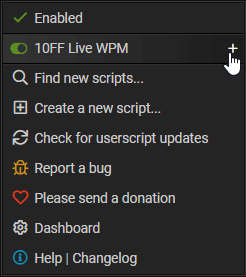

  
You can change the alignment of the values by editing the <code>alignment</code> variable to <code>left</code>, <code>center</code> or <code>right</code>:

  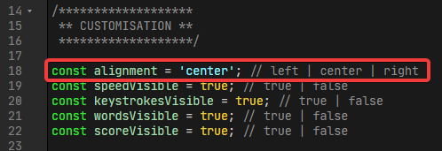

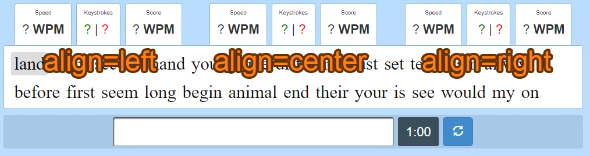

  
You can change the visibility of the values by editing the <code>*Visible</code> variables to <code>true</code> (visible) or <code>false</code> (collapsed):

  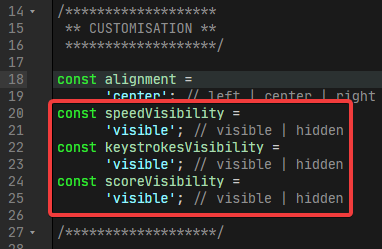

## Auto-Update

With tampermonkey, you can input an URL to the file in order to update it automatically:

### 1.

  
Click on the extension, then click on the <b>+</b> icon to the right of the script, then <b>Edit</b>

  

### 2.

  
Click on the <b>Settings</b> tab

  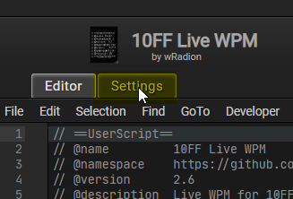

### 3.

  
On the <b>Updates</b> section, copy this URL in the textbox: <code>https://raw.githubusercontent.com/wRadion/10FFLiveWPMScript/master/script.js</code>

  

### 4.

  
Check the <b>Check for updates</b> checkbox and click <b>Save</b>

  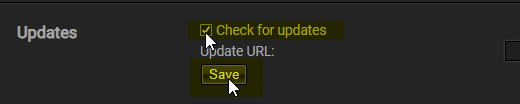

### Update interval

You can change the update interval in the tampermonkey settings:

### 1.

  
Click on the extension, then <b>Dashboard</b>

  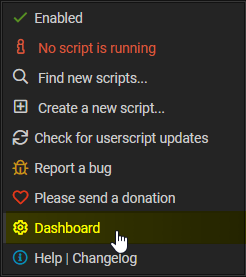

### 2.

  
Click on <b>Settings</b> on the right

  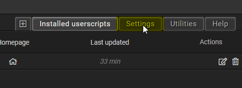

### 3.

  
In <b>Script Update</b>, you can change the <b>Check Interval</b>

  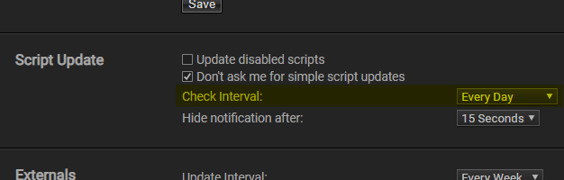

## Bug reports, suggestions, contact

If you encounter a bug or have any suggestions about the script, feel free to create a github issue or contact me on Discord: **wRadion#5043**. I'm on the [offical 10FF Discord](https://discord.gg/4KypVEM) aswell, I will probably be somewhere in the _#french_ channel.

I only understand English and French, so please try to use one of those languages when creating an issue or contacting me!
